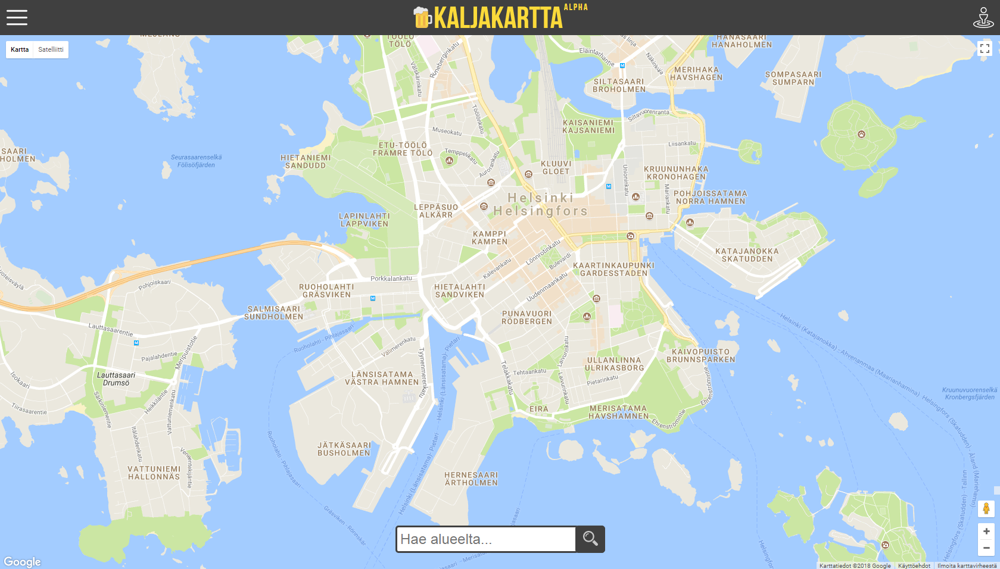
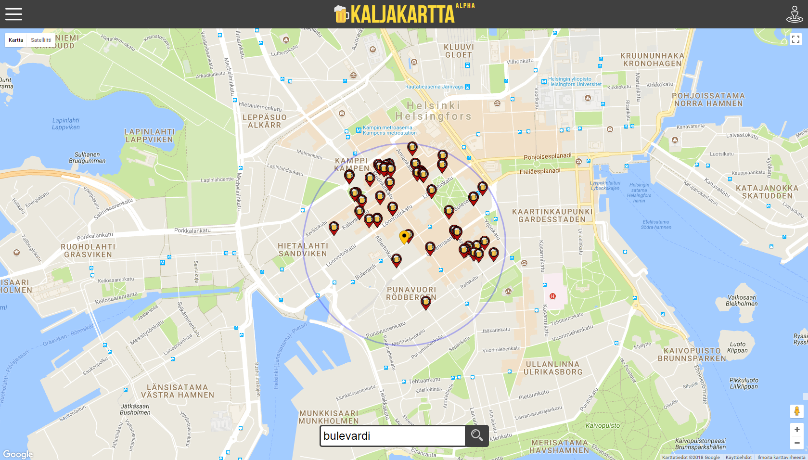

# Kaljakartta.fi #

Kaljakartta makes it easy for the user to search for beers and bars anywhere and anytime. By default it shows all bars within 1km of the user's current location but the user can narrow down the search with search criteria of their choice (price, ABV, volume, tap/bottle and distance from the bar) and move the search to any location on Google Maps. Clicking on a bar's marker shows the bar's basic info and the beer price list. Also directions from your current location to the bar (by foot/car/public transport) are available the same way you'd see them in Google Maps.

### Frontend

Frontend consists of HTML, CSS and vanilla JS. No libraries or frameworks (apart from noUiSlider for the menu sliders) were used. The map and location data are provided by Google and the price lists are from our database.

### Backend

The project backend is built using Maven as a .jar file that is run on a Ubuntu server as a systemd service. The database connection and queries are performed by a DAO class written in Java, which utilizes TinkerPop 2 -schema to interpret Java and Gremlin commands for the OrientDB graphical database and a REST interface is created between the front and the backend of the project using the Spring-Boot Framework.

### TODO features

- [ ] A login page for the bars.
- [ ] A page to let the bar owners update their own price lists. Currently we have to do it manually for each bar.

### Authors

 * **[Mirko Nowak](https://www.linkedin.com/in/mirkonowak/)** - Frontend
 * **[Aki Saastamoinen](https://www.linkedin.com/in/akisaastamoinen/)** - Backend
